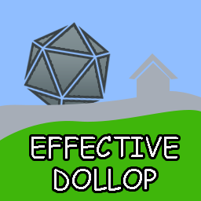

# effective-dollop
Something about a project for CST 238 GUI. 

<b>Description:</b> An incremental game idle RPG. Tentatively: The player controls a village, balancing the automatic generation of resources by upgrading buildings and assigning villagers. After a certain setup, the village sends out heroes with their current technology levels to battle the forces of <i>evil</i>. The player then gets records of these heroes a la progress quest.

<b>Technologies:</b> C++, Qt, QML

<b>Screenshots:</b> To be added later.

<b>Installation Instructions: </b>
  1. Install Qt 5.6 
  2. Open project 
  3. Clean all, run qmake, build all, run. 

<b>Contribution guidelines:</b> Tell me how I can help out including wanted features and code
standards

<b>Bugs and TODO List:</b> 
  Generate Logo.
  Add some code. 

<b>Contributor list:</b>  

  Robert Mooers 
  https://github.com/RobertMooers/

<b>Inspriations/Ideas:</b> 
http://progressquest.com/

<b>License: </b>

The MIT License (MIT)

Copyright (c) 2016 Robert Mooers

Permission is hereby granted, free of charge, to any person obtaining a copy
of this software and associated documentation files (the "Software"), to deal
in the Software without restriction, including without limitation the rights
to use, copy, modify, merge, publish, distribute, sublicense, and/or sell
copies of the Software, and to permit persons to whom the Software is
furnished to do so, subject to the following conditions:

The above copyright notice and this permission notice shall be included in all
copies or substantial portions of the Software.

THE SOFTWARE IS PROVIDED "AS IS", WITHOUT WARRANTY OF ANY KIND, EXPRESS OR
IMPLIED, INCLUDING BUT NOT LIMITED TO THE WARRANTIES OF MERCHANTABILITY,
FITNESS FOR A PARTICULAR PURPOSE AND NONINFRINGEMENT. IN NO EVENT SHALL THE
AUTHORS OR COPYRIGHT HOLDERS BE LIABLE FOR ANY CLAIM, DAMAGES OR OTHER
LIABILITY, WHETHER IN AN ACTION OF CONTRACT, TORT OR OTHERWISE, ARISING FROM,
OUT OF OR IN CONNECTION WITH THE SOFTWARE OR THE USE OR OTHER DEALINGS IN THE
SOFTWARE.
